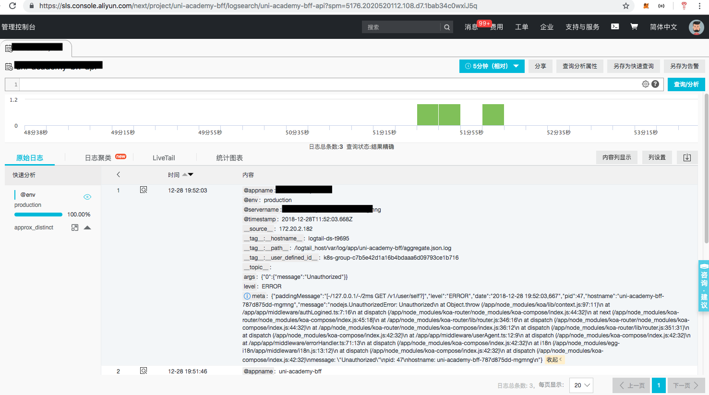

# egg-logaggregate
> aggregate egg project's logs to [Ali sls console](https://sls.console.aliyun.com).

## Why?
Aggregate egg app log and error log into a single file, which uses a dedicated json format, so that it can be easily 
integrated with [Ali sls console](https://sls.console.aliyun.com).

|Egg logs| --> |Aggregated log|
|--------|-----|--------------|
|${appInfo.name}-web.log| --> |aggregate.json.log|
|common-error.log| --> | aggregate-error.json.log|



## How?
It adds extra log transports which append extra fields to the log file in json format:
- @env
- @appname
- @timestamp

By appending these extra fields, the Ali sls console can display the project logs.

## Installation
```shell
npm install egg-logaggregate --save
```

## Usage
In egg project's config/plugin.ts
```typescript
export default const plugin: EggPlugin = {
    //...
    logaggregate: {
        enable: true,
        package: 'egg-logaggregate'
    }
    //...
}
``` 
In egg project's config/config.{env}.ts:
```typescript
export default (appInfo: EggAppInfo) => {
    return {
        //...
        config.logaggregate = {
            path: 'logs/xxx.log',
            errorPath: 'logs/xxx-error.log',
            appName: appInfo.name
        }
        //...
    }
}
```
